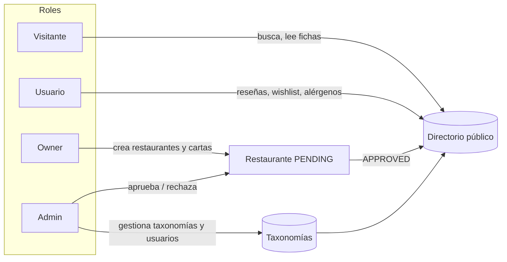
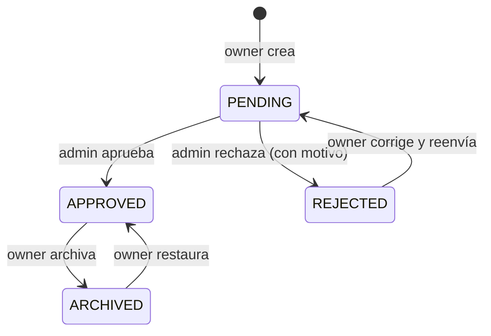

# Arquitectura

## Dominio

Foodzinder es un directorio: los dueños publican restaurantes y cartas, el administrador los valida, los usuarios los buscan, los guardan y los valoran.



### Entidades principales

| Entidad | Qué es | Reglas clave |
|---------|--------|--------------|
| `User` | Persona autenticada. El `id` es el de Clerk. | Rol `ADMIN`, `OWNER` o `USER`. Puntos y nivel para gamificación. |
| `Taxonomy` | Vocabulario controlado con `scope`: `RESTAURANT`, `MENU_PRESENTATION`, `MENU_ALLERGEN`, `MENU_CATEGORY`. | Solo el admin las crea. Slug único por scope. |
| `Restaurant` | Ficha con dirección, coordenadas, rango de precio y taxonomías. | Nace `PENDING`; el admin la pasa a `APPROVED` o `REJECTED`; el owner puede archivarla. Solo `APPROVED` es pública. |
| `Menu` | Carta que pertenece a un owner y se asigna a uno o varios de sus restaurantes. | Un menú no puede asignarse a restaurantes de otro owner. |
| `MenuCategory` | Sección de carta local a un restaurante (entrantes, postres...). | Opcionalmente enlazada a una taxonomía global como plantilla. |
| `Dish` | Plato con precio, disponibilidad y taxonomías (presentación y alérgenos). | Slug único dentro del menú. |
| `Review` | Una reseña por usuario y restaurante, con cuatro `ReviewRating`. | Criterios: `AMBIANCE`, `SERVICE`, `FOOD`, `VALUE`, de 1 a 5. Actualiza `averageRating` y `reviewCount`. |
| `WishlistItem` | Plato guardado por un usuario, agrupable por restaurante con total. | Único por usuario y plato. |
| `Plan`, `Subscription`, `Invoice`, `Coupon` | Modelo de suscripción para owners. | En esta entrega la suscripción se simula (ver ADR-0003); el esquema queda listo para Stripe. |
| `PointTransaction`, `Badge`, `UserBadge` | Gamificación. | Reglas en `src/lib/points.ts`. |
| `Notification` | Aviso interno, principalmente para el admin. | Cada notificación relevante emite además un webhook saliente. |

El esquema completo está en [prisma/schema.prisma](../prisma/schema.prisma).

## Flujo de aprobación



Cada transición emite un evento de dominio (`restaurant.created`, `restaurant.approved`, `restaurant.rejected`) que crea una `Notification` y dispara los webhooks salientes.

## Capas

```
Server Component / Route Handler
        │
        ▼
src/server/queries/*      lecturas tipadas, sin efectos
src/server/actions/*      mutaciones: Zod → auth Clerk → rol → servicio → revalidatePath
        │
        ▼
src/server/services/*     lógica de negocio pura (testeable sin Next)
        │
        ├── src/lib/db.ts             Prisma
        └── src/server/events/*       emisor de eventos → Notification + webhooks
```

Convenciones:

- Toda mutación pasa por una Server Action con el patrón validar, autenticar, comprobar rol, ejecutar servicio, revalidar caché.
- Las queries no comprueban roles por sí mismas; lo hace la página o el route handler que las llama, según la ruta.
- Los servicios reciben datos ya validados y lanzan `DomainError` con un código estable (`NOT_FOUND`, `FORBIDDEN`, `LIMIT_REACHED`, `INVALID_TRANSITION`...). El helper `runAction` de las Server Actions y los route handlers de la API los convierten en `ActionResponse<T>` o en el código HTTP correspondiente. Nada llega al cliente como excepción.
- Los servicios con lógica pura (máquina de estados, agregación de valoraciones, geodistancia, facturación) viven en ficheros sin Prisma y se testean sin base de datos.
- El middleware (`src/middleware.ts`) protege `/dashboard/*` por rol leyendo `publicMetadata.role` de la sesión de Clerk. La verificación definitiva se repite en servidor con `requireRole`.

## Autenticación y roles

Clerk gestiona identidad y sesión. El rol vive en dos sitios a propósito:

1. `publicMetadata.role` en Clerk, para que el middleware decida sin tocar la base de datos.
2. `User.role` en Prisma, para la lógica de negocio.

El webhook `POST /api/webhooks/clerk` (firmado con Svix) mantiene sincronizada la tabla `users` en `user.created`, `user.updated` y `user.deleted`. Un usuario que se registra como dueño desde `/sign-up?role=owner` recibe el rol `OWNER` mediante la Server Action `becomeOwner`, que actualiza ambos sitios.

## Geolocalización

- Al crear un restaurante, la dirección se geocodifica con Nominatim (`src/lib/geolocation.ts`) y se guardan latitud y longitud. El owner puede ajustar el marcador en el mapa.
- "Cerca de mí" usa la Geolocation API del navegador y calcula distancias con Haversine en servidor. Con menos de 10.000 restaurantes no hace falta PostGIS; queda anotado como evolución.
- El mapa de exploración es Leaflet sobre teselas de OpenStreetMap, cargado solo en cliente.

## Búsqueda

Búsqueda por texto con `ILIKE` sobre nombre, descripción y ciudad, más filtros por taxonomía, rango de precio y radio. Meilisearch queda fuera de esta entrega (ADR-0003); el cliente en `src/lib/meilisearch.ts` se conserva como punto de extensión.

## Eventos y automatización (enlace con P5)

`src/server/events/emit.ts` centraliza los eventos de dominio. Cada evento:

1. Persiste una `Notification` cuando aplica.
2. Envía un `POST` firmado (HMAC SHA-256) a cada URL de `WEBHOOK_URLS`, con reintentos.
3. Registra el intento en `webhook_deliveries` para poder auditarlo desde el panel de admin.

El contrato de eventos y de la API que consume n8n está en [api.md](api.md). Esta es la pieza que convierte P4 en la base de P5.

## Testing

- **Unitarios:** servicios y validaciones Zod, sin Next ni base de datos.
- **Contrato:** route handlers de `/api/v1/*` contra una base de datos de test, verificando forma de respuesta, códigos de estado y firma de webhooks.
- **Herramienta:** Vitest. El esqueleto traía Jest sin configurar; se cambia por Vitest por su soporte nativo de ESM y TypeScript (misma decisión que en P3).

## Despliegue

Vercel para la aplicación y Neon para PostgreSQL. CI en GitHub Actions: lint, type-check, tests y build en cada push a `main`; Vercel despliega desde su integración con GitHub. Detalle en [setup-servicios.md](setup-servicios.md) y ADR-0005.
